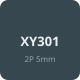
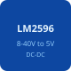
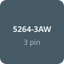

# RDS-2P Circuits

Электрические схемы для робота [RDS-2P](https://github.com/ShiWarai/RDS-2P), разработанные для лабораторного или домашнего химического травления с использованием бытовой химии.

<table>
<tr>
<td align="center" valign="middle"></td>
<td align="center" valign="middle">
</td>
</tr>
</table>

## Описание плат

- **Плата питания для RDS-2P** устанавливается в заднем отсеке робота и **питает** узлы робота.
- **Плата коммутации двигателей для RDS-2P** выполняет распределительную (силовую коммутационную) функцию и **сокращает количество** проводов.

## Компоненты

### Плата питания для RDS-2P

| Имя | Кол-во | Изображение | Примечание |
|-----|--------|-------------|------------|
| XT30U | 6 |  | Лучше покупать парами |
| XY301V-A-5.0-2P | 3 |  | Можно заменить на провода с разъёмами |
| BMS 2S 20A, защита Li-ion с балансировкой | 1 |  | <a href="https://www.ozon.ru/product/bms-2s-20a-plata-zashchity-s-balansirovkoy-1sht-kontroller-zaryada-li-ion-batarey-s-balansirovkoy-1929224672/">Ozon</a> |
| DC-DC понижающий LM2596S, 8–40 V → 5 V | 2 |  | <a href="https://www.ozon.ru/product/ponizhayushchiy-preobrazovatel-dc-dc-8-40v-na-5v-lm2596s-stabilizator-5v-2sht-2024449951/">Ozon</a> |

### Плата коммутации двигателей для RDS-2P

| Имя | Кол-во | Изображение | Примечание |
|-----|--------|-------------|------------|
| 5264-3AW (клеммник, 3 контакта) | 4 |  |  |
| XT30U | 1 |  | Лучше покупать парами |
| XY301V-A-5.0-2P | 1 |  | Можно заменить на провода с разъёмами |
